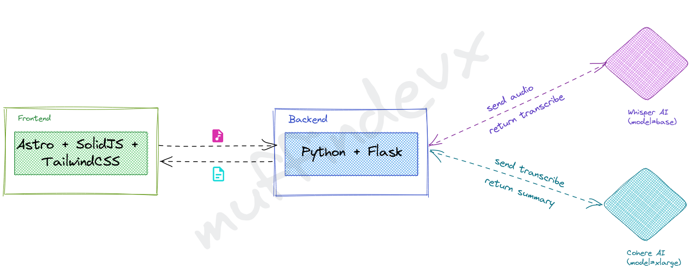

## Intro

This project was built to participate in the COHERE hackaton. In this project, I built a web application
to transcribe and summary audios. For this project, I used differents technologies such as: Astro, SolidJS and TailwindCSS.



## Usage

```bash
$ pnpm start
```

after that, you can navigate to http://localhost:3000

## Screenshots

- [Home](Landing.png)
- [Upload File](UploadFile.png)
- [Summary](Summary.png)
